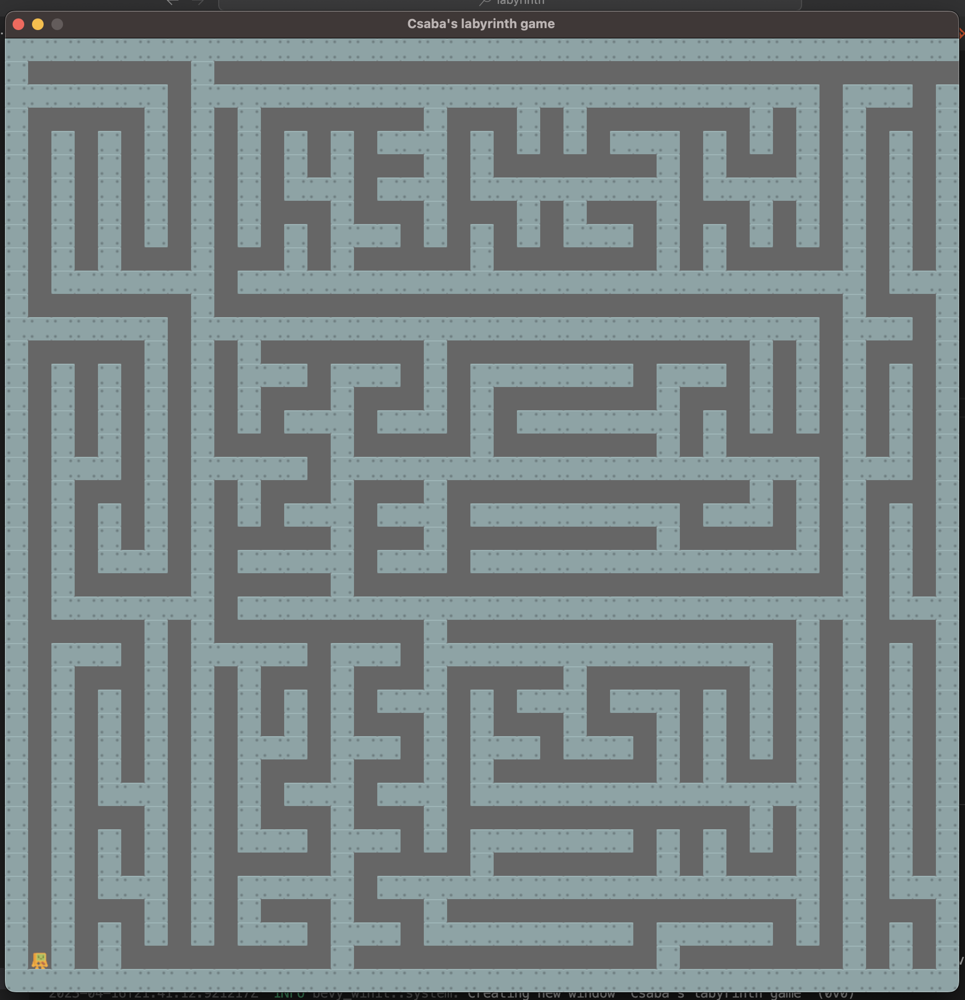

# Simple labyrinth-based game (WIP)

WASM version: https://palankai.github.io/labyrinth-rs/



## How to run

It is tested on Apple M1 MacOS Ventura.
However, it probably works on Linux too, maybe even on Windows.

You should have [Rust](https://www.rust-lang.org/) installed.

```
cargo run
```

### Controls
- Menu: P -> Play
- Menu: Q -> Quit

- Game: WASD / Up/Left/Down/Right Controls the player
- Game: ESC -> Back to menu


## Assets

### Fonts
- https://github.com/bevyengine/bevy/tree/main/assets/fonts

### Sprites
- https://kenney.nl/assets/simplified-platformer-pack
